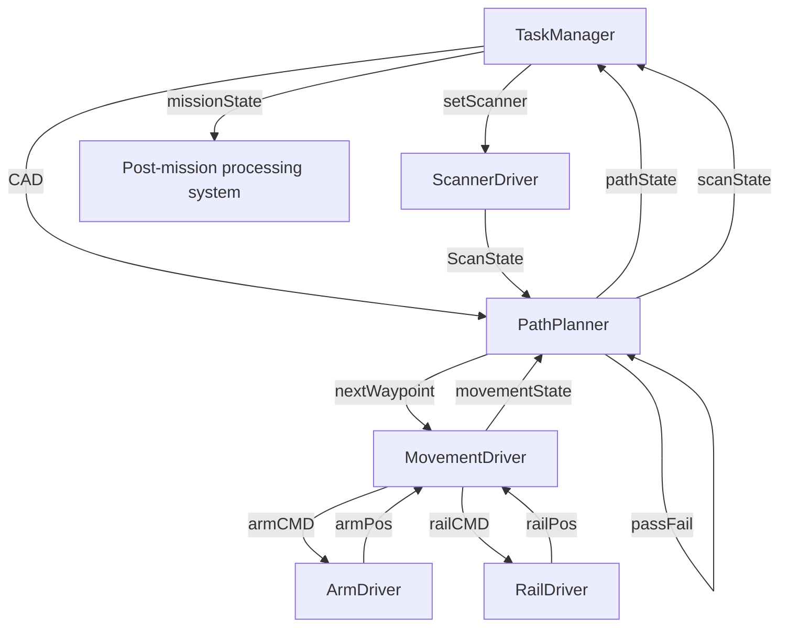

# ROS 2 Node Graph

> Part of [[Quality Control Scanner]] · companion to [[architecture]]

The runtime software is a set of ROS 2 **nodes** that talk over named
**topics** (pub = publish, sub = subscribe). This is the control-side graph
that drives the arm, the track and the scanner through one scan mission. It is
the ROS 2 realisation of the [pipeline](architecture.md#pipeline) — the
orchestrator's sequential steps become nodes exchanging messages.

Decided by the owner on 2026-07-08. This note is the **authoritative record of
that decision**; see the open questions at the bottom for the points still to
pin down.

## Nodes and their topics

| Node | Publishes | Subscribes |
|------|-----------|------------|
| **TaskManager** | `missionState`, `CAD`, `setScanner` | `pathState`, `scanState` *(implied — see Q2)* |
| **PathPlanner** | `nextWaypoint`, `pathState`, `scanState`, `passFail` | `movementState`, `CAD` |
| **MovementDriver** | `armCMD`, `railCMD`, `movementState` | `nextWaypoint`, `armPos`, `railPos` |
| **ArmDriver** | `armPos` | `armCMD` |
| **RailDriver** | `railPos` | `railCMD` |
| **ScannerDriver** | `ScanState` | `setScanner` |

## Topic map (who feeds whom)

| Topic | Publisher → Subscriber | Meaning |
|-------|------------------------|---------|
| `CAD` | TaskManager → PathPlanner | The CAD model for the part being inspected (selected by part ID). |
| `setScanner` | TaskManager → ScannerDriver | Command/config to arm or trigger the scanner. |
| `nextWaypoint` | PathPlanner → MovementDriver | The next probe pose to move to. |
| `armCMD` | MovementDriver → ArmDriver | Low-level command to the SR5 arm. |
| `railCMD` | MovementDriver → RailDriver | Low-level command to the custom 3 m rail. |
| `armPos` | ArmDriver → MovementDriver | Actual arm joint/pose feedback. |
| `railPos` | RailDriver → MovementDriver | Actual rail position feedback. |
| `movementState` | MovementDriver → PathPlanner | Fused "am I there yet / settled" state, closes the motion loop. |
| `pathState` | PathPlanner → TaskManager | Progress through the planned path. |
| `scanState` | PathPlanner → TaskManager | Scan progress as the planner sees it *(vs `ScanState`, see Q1)*. |
| `ScanState` | ScannerDriver → ? | The scanner hardware's own state *(subscriber TBD — see Q1)*. |
| `passFail` | PathPlanner → ? | Quality-gate result; **also acts as a trigger to (re)start scanning** *(see Q3)*. |
| `missionState` | TaskManager → downstream | Whether the mission is complete; hands off to the processing system *(see Q5)*. |

## The control loop

**In words:**

1. **TaskManager** starts a mission: it publishes the `CAD` model for the part,
   sets up the scanner via `setScanner`, and tracks overall `missionState`.
2. **PathPlanner** has the `CAD` and, using `movementState` feedback, emits the
   `nextWaypoint` to visit.
3. **MovementDriver** turns each waypoint into `armCMD` + `railCMD`, reads back
   `armPos` + `railPos` from the two hardware drivers, and fuses them into
   `movementState` — closing the loop back to PathPlanner.
4. **ArmDriver** / **RailDriver** are the thin hardware layers: command in,
   position out. ArmDriver wraps the SR5 (`rokae_ros2` / xCore SDK); RailDriver
   wraps the custom 3 m rail's drive controller.
5. **ScannerDriver** wraps the Revopoint MIRACO Plus (RevoLink SDK bridge). It
   reacts to `setScanner` and reports `ScanState`.
6. **PathPlanner** reports `pathState` and `scanState` up to TaskManager.
   **`missionState` is a function of `scanState` and `pathState`** — the mission
   is "done" when both say so.
7. **On mission complete**, a **second system** takes over: the scanner-software
   side — point-cloud processing, CAD comparison, pass/fail. This is the Phase 2
   work in [TODO.md](../TODO.md); it is downstream of `missionState`.
8. **`passFail`** is a quality-gate outcome that also serves as **a trigger to
   (re)start the scanning process** (e.g. rescan on a failed gate).

## Design notes

- The motion path is a **feedback loop**: PathPlanner ↔ MovementDriver ↔
  hardware drivers. Nothing advances until `movementState` confirms the arm has
  settled — this is the **index-and-shoot** behaviour from the architecture doc
  (the rail is not a coordinated joint).
- **Two-stage system**: the control graph above gets the scanner to every pose
  and captures data; a separate post-processing system turns that data into a
  verdict. `missionState` is the handoff between the two.
- Hardware drivers are deliberately **thin** (command/position only) so the SR5,
  the rail and the scanner can each be swapped or simulated without touching the
  planning logic.

## Open questions (to resolve with the owner)

1. **`scanState` vs `ScanState`** — PathPlanner publishes `scanState`;
   ScannerDriver publishes `ScanState`. Are these the same topic (fix the case
   mismatch) or two distinct topics? Who is the single owner of "scan state",
   and who subscribes to `ScanState`?
2. **TaskManager subscriptions** — not given explicitly, but `missionState`
   depends on `scanState` + `pathState`, so TaskManager must subscribe to both.
   Confirm.
3. **`passFail` wiring** — published by PathPlanner and described as "a trigger
   to start the scanning process." Which node subscribes, and does it trigger a
   rescan, a ScannerDriver capture, or advance the mission?
4. **`CAD` on the wire** — passing a whole CAD model as a topic message is
   heavy. Consider a path/part-ID string on the topic (or a service/parameter)
   rather than the mesh itself.
5. **Post-mission processing** — is the "second system" a separate ROS 2 graph,
   an offline pipeline, or nodes triggered by `missionState`? Maps to Phase 2 in
   [TODO.md](../TODO.md).
6. **Naming convention** — topics are currently camelCase; ROS 2 convention is
   snake_case (`/mission_state`, `/next_waypoint`). Decide a convention before
   implementation.
7. **Services/actions vs topics** — one-shot commands (`setScanner`, a capture
   request) and long-running moves may fit ROS 2 **services**/**actions** better
   than fire-and-forget topics. See [[ROS 2 Theory — Beginner to Advanced]].
